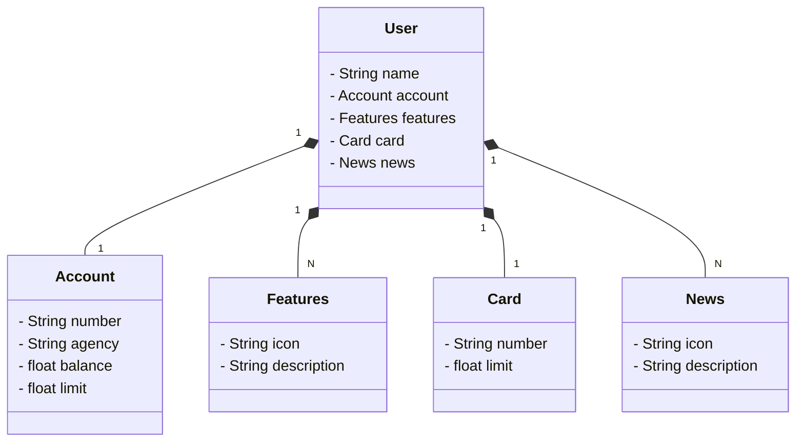

# Santander Dev Week 2023 - Java RESTful API

Bem-vindo ao repositório da API desenvolvida durante a Santander Dev Week 2023! Esta API foi criada como parte de um curso promovido pelo Santander, oferecendo uma oportunidade emocionante para explorar e aprimorar habilidades em desenvolvimento de software.

### Visão Geral:
Este projeto consiste em uma API RESTful implementada em Java, projetada para fornecer funcionalidades essenciais em um contexto bancário. Durante a Santander Dev Week, os participantes tiveram a chance de mergulhar no mundo do desenvolvimento de APIs, explorando conceitos fundamentais e aplicando-os na construção deste sistema.

## Diagrama de Classes

### Perfis e Tecnologias Utilizadas:
Este projeto possui dois perfis de execução:

- **Perfil de Desenvolvimento (application-dev):** Utiliza um banco de dados em memória para testes locais.
- **Perfil de Produção (application-prd):** Utiliza o PostgreSQL como banco de dados para ambientes de produção.

### Tratamento de Erros:
Um tratamento de erros abrangente foi implementado dentro da classe `GlobalExceptionHandler`, garantindo uma resposta adequada a todas as exceções geradas durante a execução da API.

### Tecnologias Utilizadas:
- **Java 17**
- **Spring Boot 3.2.5**
- **Swagger:** Utilizado para testar os métodos `findById` e `create`, que são responsáveis por encontrar usuários e criar e salvá-los no banco de dados PostgreSQL.

### Hospedagem:
O projeto está hospedado na plataforma Railway. Você pode acessá-lo através do seguinte link: [Santander Dev Week 2023 - API](https://santander-dev-week-2023-production-app.up.railway.app).

### Contribuições:
Este repositório está aberto a contribuições da comunidade. Se você tem ideias para melhorias, correções de bugs ou novos recursos, sinta-se à vontade para abrir um *pull request*. Todas as contribuições serão revisadas e consideradas.

### Agradecimentos:
Agradecemos ao Santander por fornecer esta oportunidade de aprendizado e desenvolvimento. Esperamos que este projeto possa servir como uma referência útil para futuros desenvolvedores que desejam explorar o mundo das APIs RESTful em Java.

---

## Santander Dev Week 2023 - Java RESTful API

Welcome to the repository of the API developed during Santander Dev Week 2023! This API was created as part of a course promoted by Santander, offering an exciting opportunity to explore and enhance software development skills.

### Overview:
This project consists of a Java-based RESTful API designed to provide essential functionalities in a banking context. During Santander Dev Week, participants had the chance to dive into the world of API development, exploring fundamental concepts and applying them in the construction of this system.

### Class Diagram:

### Profiles and Technologies Used:
This project has two execution profiles:

- **Development Profile (application-dev):** Utilizes an in-memory database for local testing.
- **Production Profile (application-prd):** Uses PostgreSQL as the database for production environments.

### Error Handling:
Comprehensive error handling has been implemented within the `GlobalExceptionHandler` class, ensuring an appropriate response to all exceptions generated during API execution.

### Technologies Used:
- **Java 17**
- **Spring Boot 3.2.5**
- **Swagger:** Used to test the `findById` and `create` methods, which are responsible for finding users and creating and saving them in the PostgreSQL database.

### Hosting:
The project is hosted on the Railway platform. You can access it through the following link: [Santander Dev Week 2023 - API](https://santander-dev-week-2023-production-app.up.railway.app).

### Contributions:
This repository is open to contributions from the community. If you have ideas for improvements, bug fixes, or new features, feel free to open a pull request. All contributions will be reviewed and considered.